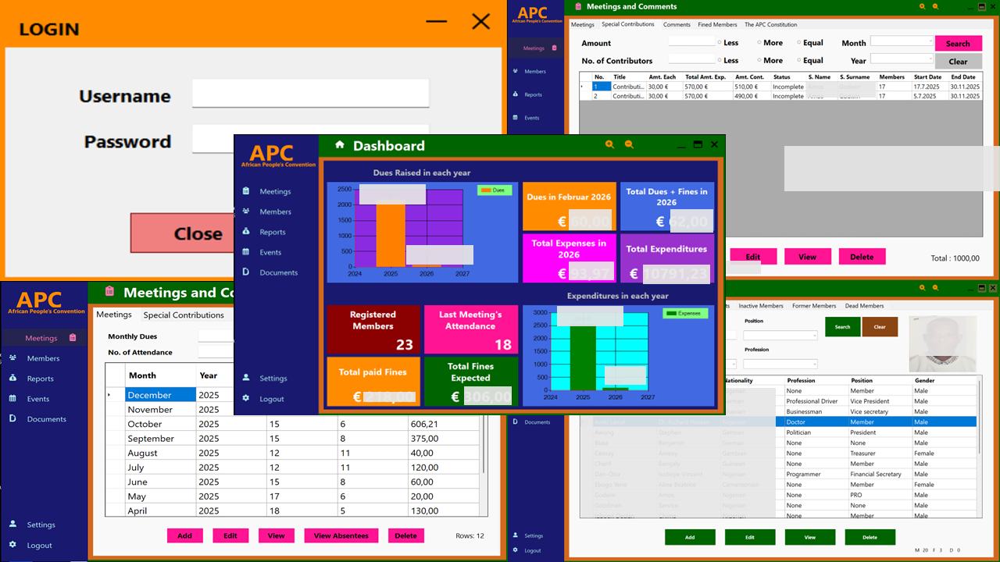
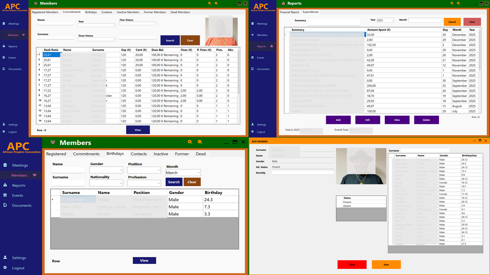
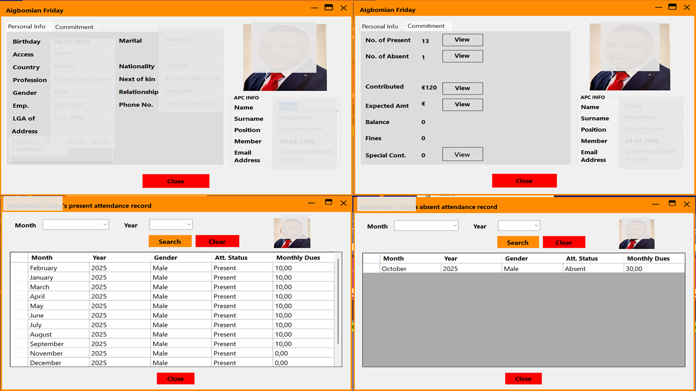
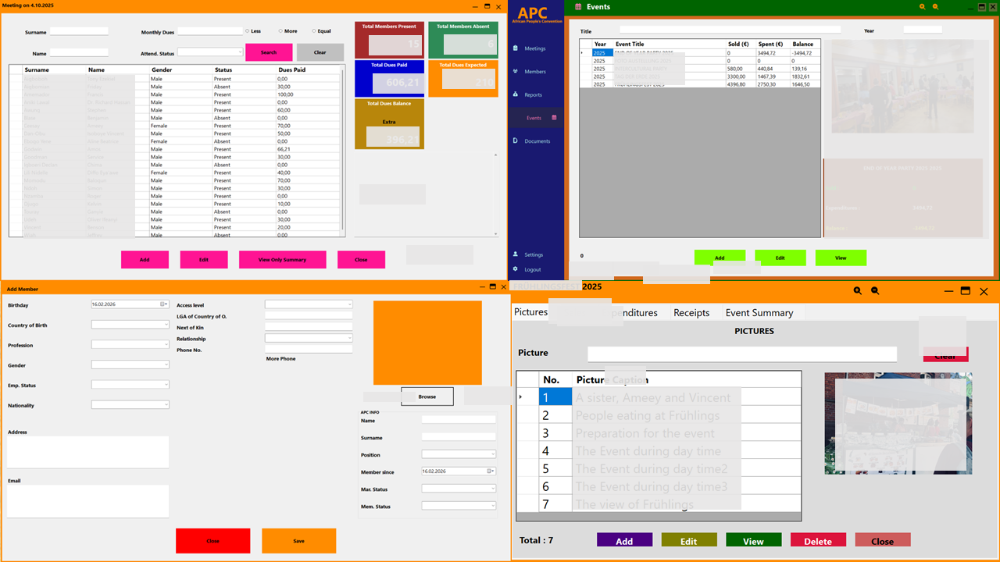

## APC Nexus – Enterprise Membership & Financial Management System

### Overview

APC Nexus is a full-featured enterprise desktop application designed to manage membership operations, 
financial contributions, attendance tracking, fines, events, and reporting for organizations and associations.

The system provides a structured 3-Layer Architecture (UI – BLL – DAL) ensuring maintainability, scalability, 
and clean separation of concerns.

It is built using:

- C# (.NET Framework)
- Windows Forms (WinForms)
- Entity Framework
- SQL Server


The Login page provides secure access to the system for authorized members of the organization. 

The Dashboard provides a real-time overview of the organization’s financial and membership statistics. Acts as the executive control center for 
decision-making.

Form Meeting & Contributions manages monthly meetings, attendance, and dues tracking. Tracks member participation and financial obligations per meeting.



The Members module manages the full lifecycle of all registered members. Centralized member management with financial and attendance integration.

Form Member Profile (Personal Info) detailed view of individual member information. Provides a complete personal overview of each member.



Form Attendance Record shows detailed attendance history for each member. Maintains accurate historical participation records.

Form used to register new members into the system. Provides structured onboarding for new members.



Form Setting Module manages system reference data. Keeps system data dynamic and configurable without modifying code.

Member Committment Overview displays financial and attendance summary for individual members. Provides accountability tracking per member.




### Architecture

The application follows a structured enterprise architecture:

````
APC
│
├── UI Layer (WinForms)
│   ├── Forms
│   ├── Controls
│   └── User Interaction Logic
│
├── BLL (Business Logic Layer)
│   ├── Validation
│   ├── Business Rules
│   └── DTO Handling
│
└── DAL (Data Access Layer)
    ├── Entity Framework Context
    ├── DAO Classes
    ├── LINQ Queries
    └── Database Operations
````

### Design Patterns Used

- DTO Pattern
- DAO Pattern
- Layered Architecture
- Repository-like Data Handling
- LINQ-based Querying
- Soft Delete Strategy

### Core Features

#### 🔐 Authentication & Access Control

- Secure login system
- Role-based permissions
- Dynamic access level management
- Member credential auto-generation

#### 👥 Membership Management

- Add / Edit / View / Delete Members
- Profile image upload & storage
- Membership status tracking:
    - Current
    - Former
    - Inactive
    - Deceased
- Birthday tracking
- Nationality statistics
- Gender distribution analytics
- 3-Month Absentee detection

#### 📅 Meeting Management

- Monthly meeting tracking
- Attendance monitoring:
    - Present
    - Absent
- Monthly dues tracking
- Dues paid vs expected
- Absentee detection logic (last 3 meetings)

#### 💰 Financial Management

- Monthly dues tracking
- Fine management system
- Special contributions
- Event financial tracking
- Financial reporting:
    - Total Raised
    - Total Spent
    - Balance
- Yearly breakdown
- Automatic balance calculations

#### 📊 Reporting & Dashboard

- Real-time financial dashboard
- Attendance statistics
- Member distribution
- Unique nationality count
- Unique profession count
- Position analytics
- Fine summary
- Event balance tracking

#### 🎉 Event Management4

- Event creation & management
- Sales tracking
- Expenditure tracking
- Balance computation
- Event summary analytics
- Picture storage per event

#### ⚙ Settings Module

Manage system reference data:

- Countries
- Nationalities
- Positions
- Professions
- Marital Status
- Employment Status
- Membership Status
- Permissions

#### 🧠 Smart Business Logic

The system includes advanced logic such as:

- Auto username generation (apcXXXXX)
- Auto password generation from birthday
- Automatic fine calculation
- Meeting-based expected dues calculation
- 3 consecutive absence detection
- Soft delete with recovery
- Permission-based UI visibility
- Deceased age calculation

#### 🗃 Database Strategy

- Entity Framework (Code First / Database First compatible)
- Soft delete pattern (isDeleted)
- Relational integrity via foreign keys
- LINQ joins for DTO population
- Structured membership state transitions

#### 📁 Folder Structure

````
APC
│
├── APC (UI)
├── APC.BLL
├── APC.DAL
│   ├── DAO
│   ├── DTO
│   └── Context
├── images
└── Database
````

### 🧰 Setup Instructions

#### 1. Requirements

- Visual Studio 2022
- .NET Framework
- SQL Server
- Entity Framework installed

- #### 2. Clone Repository

git clone https://github.com/isoboye24/APC_APP_.git

#### 3. Configure Database

Update connection string in App.config

#### 4. Run Project

- Set APC (UI) as startup project
- Press F5

### 🏢 Project Type

Enterprise Desktop Application
Association / Organization Management System

👨‍💻 Author

Developed as a professional enterprise-grade membership management platform using structured architecture and clean separation of concerns.

📜 License

Private / Organizational Use